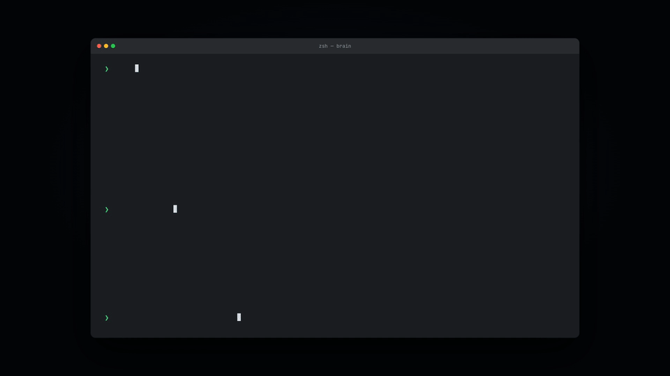
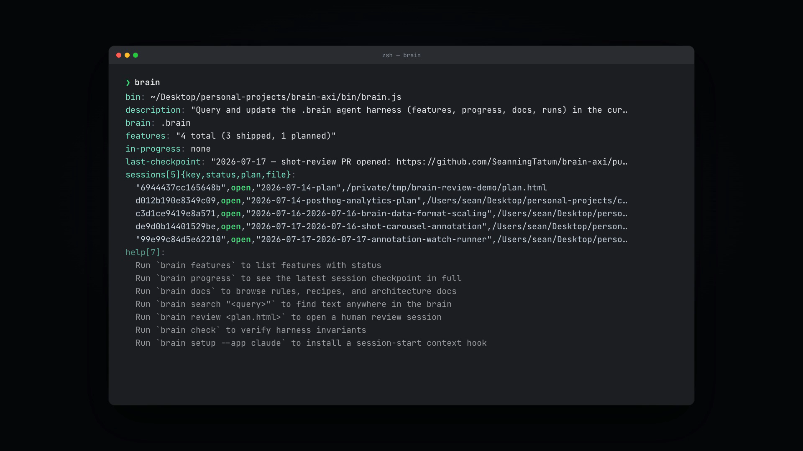
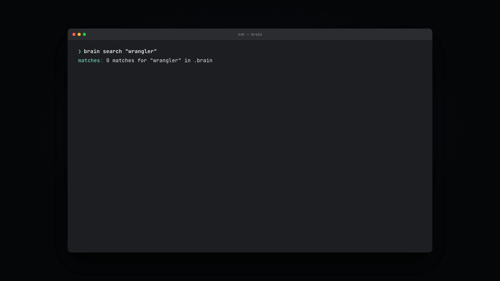
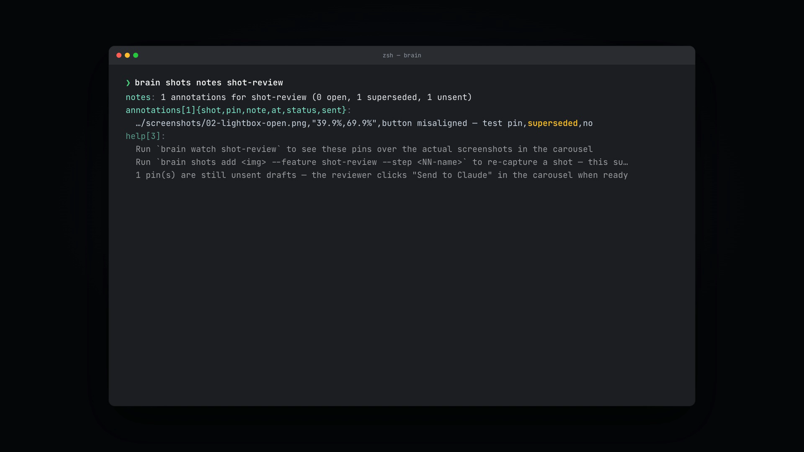

# brain-axi

**A CLI that gives coding agents a memory.**

`brain` is a single-file, zero-dependency Node tool that reads and writes a `.brain/` directory — the durable knowledge layer (features, progress checkpoints, rules, recipes, run notes, plan reviews, screenshot feedback) that survives across agent sessions. Agents shell out to it; humans get a queryable project brain for free.



## Why

Every new agent session starts from zero. It re-reads the codebase, re-derives what's in progress, re-asks "what did we decide last time," and — worst of all — sometimes forgets a decision was ever made and re-litigates it. Context windows reset; institutional memory shouldn't.

`.brain/` is that memory: a plain directory of JSON and Markdown living in your repo, checked into git like everything else. `brain` is the interface to it — one command to check feature status, one to append a checkpoint, one to search every rule and recipe you've ever written down. Agents run it via shell like any other CLI. No MCP server, no daemon, no API key.

The output is [TOON](https://toonformat.dev/), not JSON or prose: minimal default schemas, pre-computed counts, truncated bodies with a `--full` escape hatch, definitive empty states, and a `help:` block at the end of *every* command teaching the agent what to run next. That last part matters — the CLI's own output is how agents learn to use it, so a fresh agent with no prior context can bootstrap correctly on the first invocation.

## Quick start

```sh
npm link                          # puts `brain` on PATH from this checkout
# or, without installing anything:
npx -y brain-axi <command>
```

Requires Node 18+. No dependencies, no build step, no config file.

Point it at an existing `.brain/` (it walks up from cwd to find one, or take `--brain <path>`):

```sh
$ brain
brain: .brain
features: "4 total (3 shipped, 1 planned)"
in-progress: none
last-checkpoint: "2026-07-17 — shot-review PR opened: https://github.com/.../pull/4 — carousel + annotation + CTA toast + shots notes verb, all verified."
sessions[5]{key,status,plan,file}:
  "6944437cc165648b",open,"2026-07-14-plan",/private/tmp/brain-review-demo/plan.html
  ...
help[7]:
  Run `brain features` to list features with status
  Run `brain progress` to see the latest session checkpoint in full
  Run `brain docs` to browse rules, recipes, and architecture docs
  Run `brain search "<query>"` to find text anywhere in the brain
  Run `brain review <plan.html>` to open a human review session
  Run `brain check` to verify harness invariants
  Run `brain setup --app claude` to install a session-start context hook
```



No `.brain/` yet? Scaffold one from a base template with the `init-brain` skill, or hand-roll the [layout below](#the-brain-layout).

## Commands

Every command supports `--help` (self-documenting) and a global `--brain <path>` override. Unknown flags are rejected with the valid flag set (exit 2), and every successful result ends with a `help:` block of next steps.

### State — features & checkpoints

| Command | What it does |
|---|---|
| `brain features [--status s] [--fields ...] [--limit n]` | List features from `feature_list.json` |
| `brain features view <slug> [--full]` | Tracker fields + feature doc body |
| `brain features set-status <slug> --status <s> [--evidence "..."]` | Flip feature state — enforces `one_in_progress_at_a_time`, idempotent |
| `brain progress [--limit n]` | Latest session checkpoint in full + older-entry index |
| `brain progress add --summary "..." [--next "..."]` | Append a checkpoint to `runs/progress.md` |
| `brain ship <slug> --evidence "..."` | Flip a feature to `shipped`: requires evidence, checks for screenshots, checkpoints, runs `brain check` |
| `brain pr <slug> --url <pr-url>` | Record the feature's opened pull request (the execution dashboard's terminal state) |

### Knowledge — docs, rules, recipes, search

| Command | What it does |
|---|---|
| `brain docs [section]` | Browse sections: `rules`, `recipes`, `codebase`, `architecture`, `features`, `emails`, `transcripts` |
| `brain docs view <section>/<name> [--full]` | Read one doc |
| `brain search "<query>" [--section s] [--limit n]` | Case-insensitive text search across the whole brain |
| `brain runs` / `brain runs view <name> [--full]` | Per-task run notes (deep task state) |
| `brain playbook [id]` | Authoring playbooks for agent-produced artifacts (plan, verify, execute) |

### Workflow — plans & human review

| Command | What it does |
|---|---|
| `brain review <plan.html> [--plan s] [--feature s] [--port n] [--no-open] [--reopen]` | Open a human review session for a plan artifact in the browser |
| `brain review poll <plan.html> [--agent-reply "..."] [--snapshot] [--timeout-ms n]` | Long-poll for reviewer feedback — leave running until it returns |
| `brain review end <plan.html>` | End an open review session (marks the plan reviewed) |
| `brain plans` / `brain plans view <slug> [--full]` | List plan review artifacts, or one plan's meta + review rounds |
| `brain verifications [feature]` / `brain verifications view <feature> <date> [--full]` | List or read feature verification (browser-walk) verdict docs |
| `brain timeline [--limit n]` | Merged history: checkpoints, run notes, plan creations, review rounds |

### Screenshot review loop

| Command | What it does |
|---|---|
| `brain shots [feature]` | List review screenshots (per-feature + legacy); gains a `notes` column once any shot carries an annotation |
| `brain shots add  --feature <slug> --step <NN-name> [--caption "..."]` | File a screenshot into the brain (`--scope <name>` is the legacy form) |
| `brain shots notes <feature>` | List reviewer pin+note annotations — pin coords, note preview, timestamp, open/superseded, sent/unsent |
| `brain watch <feature> [--port n] [--no-open]` | Open the live execution dashboard: progress, run-step logs, verifications, PR state, screenshot carousel |

### Setup & integrity

| Command | What it does |
|---|---|
| `brain context` | Compact dashboard used by session-start hooks (silent, exit 0, outside a brain repo) |
| `brain setup --app <claude\|codex\|opencode\|copilot\|all>` | Install a SessionStart hook that injects `brain context` |
| `brain skill [--write\|--check]` | Generate/verify the installable agent skill (`skills/brain/SKILL.md`); `--check` is CI-friendly |
| `brain check` | Run deterministic harness invariant checks (CI-usable: exit 1 on any failure) |

**Exit codes**: `0` success (including no-ops), `1` operation error, `2` usage error. Errors print to stdout as `error:` + `help:` lines — stdout is always the parseable payload, stderr stays diagnostics-only.

## Finding things fast

```sh
$ brain search "wrangler"
matches: 0 matches for "wrangler" in .brain
```



An empty result is still a definitive answer — no ambiguity about whether the search ran.

## Giving agents ambient brain context

Two complementary paths — install either or both:

1. **Session hook (recommended)** — `brain setup --app claude` (or `codex` / `opencode` / `copilot` / `all`). Every new agent session in the repo starts with the compact `brain context` dashboard: live feature state, last checkpoint, next step. Re-running repairs the hook path after a reinstall; repeated runs are no-ops.
2. **Agent skill (lower overhead, broader support)** — `brain skill --write` generates `skills/brain/SKILL.md`, loadable on demand by any skill-aware agent (`npx skills add <owner>/<repo> --skill brain`). No per-session token cost; static guidance only. `brain skill --check` exits 1 if the committed file has drifted from the CLI's real commands — wire it into CI.

## Screenshot review loop

Screenshots captured with `brain shots add  --feature <slug> --step NN-name` are never opened one-tab-per-image: the `/watch/<feature>` execution dashboard (`brain watch <feature>`) and a `brain review` session's execution sidebar both render them in a shared in-page carousel — arrows, ←/→/Esc, counter, captions, filmstrip, and a placeholder for a missing file.

Toggle **Annotate** in the carousel and click a screenshot to drop a numbered pin at that x/y and write a note:

- On the dashboard, the pin saves as an unsent draft. "Send N pins to Claude" (the topbar button, or the toast shown right after pinning) hands the whole batch to the agent and stamps it sent.
- In a review session's sidebar, the same pin instead queues immediately as a screenshot-tagged prompt in the composer, delivered on the next Send like any other annotation, through the normal `brain review poll` loop.

Re-capturing the shot (`brain shots add` again for the same feature/step) makes its earlier annotations read as **superseded** — that's the resolution signal; there is no separate "mark done" action.

The agent reads pending feedback with `brain shots notes <feature>`:



```
$ brain shots notes shot-review
notes: 1 annotations for shot-review (0 open, 1 superseded, 1 unsent)
annotations[1]{shot,pin,note,at,status,sent}:
  features/shot-review/screenshots/02-lightbox-open.png,"39.9%,69.9%",button misaligned — test pin,"2026-07-17T05:28:36.708Z",superseded,no
help[3]:
  Run `brain watch shot-review` to see these pins over the actual screenshots in the carousel
  Run `brain shots add  --feature shot-review --step <NN-name>` to re-capture a shot — this supersedes its open annotations
  1 pin(s) are still unsent drafts — the reviewer clicks "Send to Claude" in the carousel when ready
```

Planned, not yet shipped: a `brain watch poll <feature>` long-poll runner (mirroring `brain review poll`) so "Send to Claude" wakes the agent immediately instead of waiting on the next `brain shots notes` check.

## The `.brain` layout

```
.brain/
  features/feature_list.json   # machine-readable feature status (source of truth)
  features/<slug>/<slug>.md    # one doc per feature, plus plans/ verifications/ screenshots/
  runs/progress.md             # rolling session checkpoint log
  runs/<date>-<slug>.md        # per-task deep state
  rules/ recipes/ codebase/ high-level-architecture/
```

See `.brain/HARNESS.md` in a scaffolded brain for the 5-subsystem harness model this serves: instructions, state, verification, scope, lifecycle.

## Design principles

- **Single file, zero deps.** `bin/brain.js`, Node ESM, `node >=18`. Nothing to install, nothing to break.
- **TOON, not JSON or prose.** Token-efficient for agents to parse and for you to eyeball; see [toonformat.dev](https://toonformat.dev/).
- **Contextual disclosure.** Every command teaches the next command through its own `help:` output — an agent with zero prior knowledge of `brain` can still use it correctly.
- **Exit codes are the contract.** `0`/`1`/`2` are meaningful and stable; scripts and CI can depend on them.
- **Idempotent by default.** Re-running `setup`, `skill --write`, or `set-status` to the same state is always a safe no-op.
